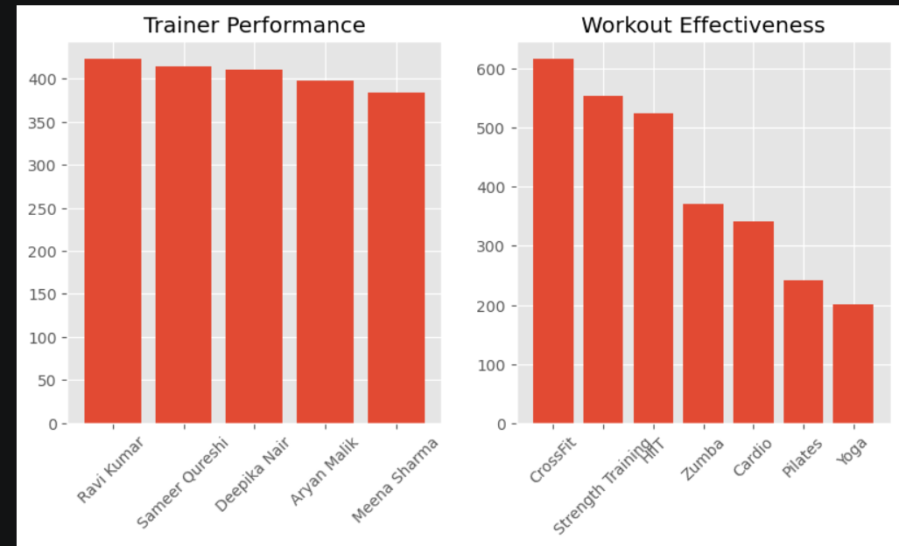
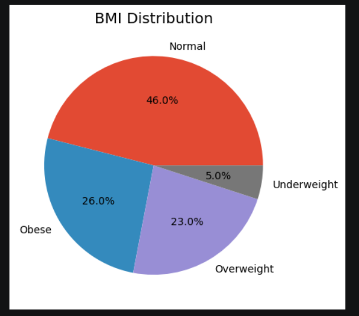
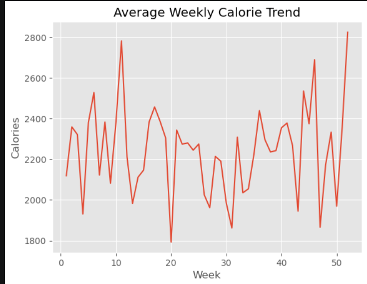
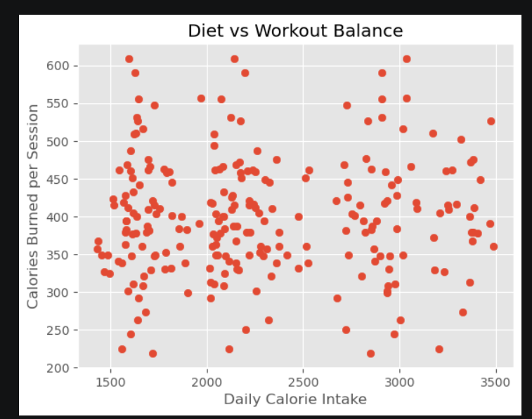
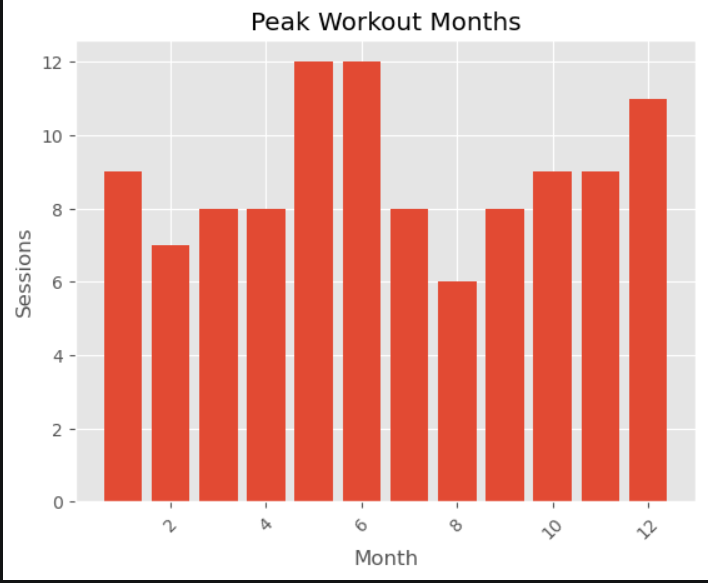
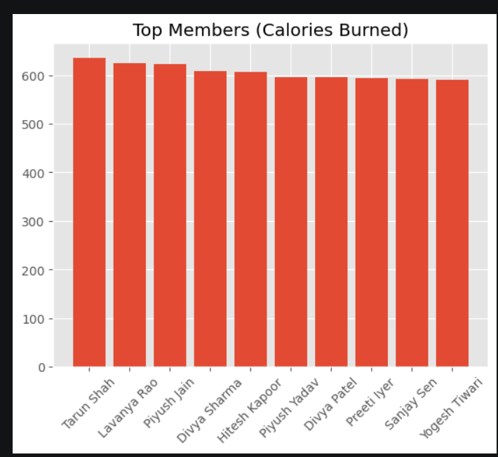
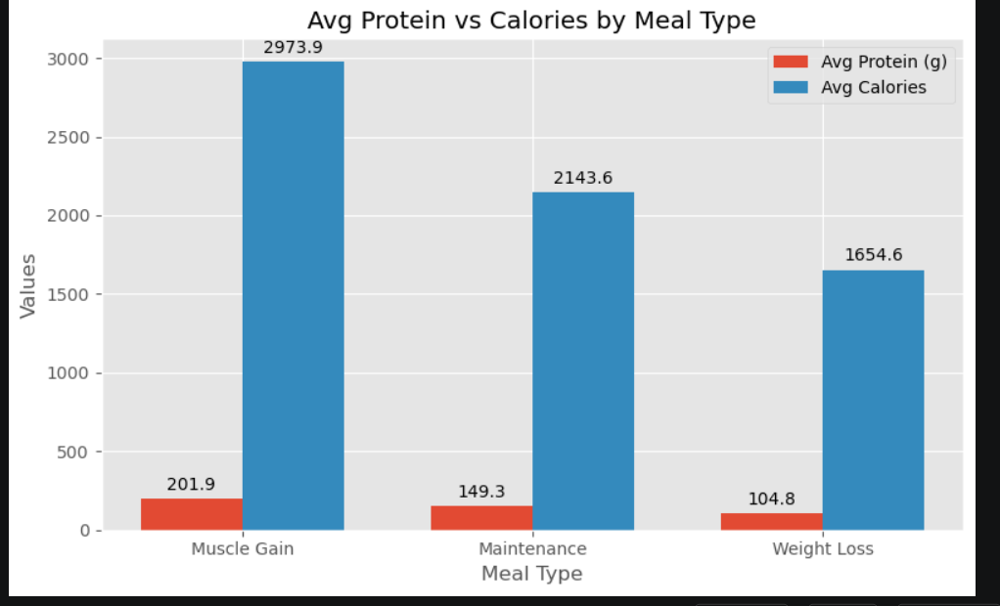

# 🏋️ GymPulse — Cloud-Based Fitness Analytics Pipeline

An end-to-end **ETL and data analytics pipeline** built on **AWS S3, AWS Glue, Amazon Athena, and Amazon QuickSight**, designed to process and analyze fitness data for 250+ gym members — covering workouts, diet logs, trainers, and member profiles.

> Project by 23/IT/040 & 23/IT/056 | DTU

---

## 📌 Overview

GymPulse ingests raw gym operational data (members, workout logs, diet logs, trainers) from CSV files, cleans and transforms it using **AWS Glue (PySpark)**, catalogs it for **serverless SQL analytics via Amazon Athena**, and visualizes key trends through **interactive Amazon QuickSight dashboards** as well as a Python/Matplotlib notebook run on **Amazon SageMaker**.

### Key highlights
- Built an **end-to-end ETL and data analytics pipeline** using AWS S3, AWS Glue, Amazon Athena, and Amazon QuickSight to process and analyze fitness data for 250+ gym members.
- Implemented **data cleaning, transformation, and aggregation workflows** using AWS Glue to convert raw member and workout data into structured, reliable datasets for downstream analytics.
- Developed **interactive Amazon QuickSight dashboards** to visualize member progress, workout trends, and key performance indicators (KPIs), enabling data-driven fitness performance analysis.

---

## 🏗️ Architecture

```
                ┌─────────────────┐
  Raw CSVs  ──▶ │   Amazon S3      │  (raw/ zone)
 (members,      │   gym-analytics- │
  workouts,     │   bucket         │
  diet, trainer)└────────┬─────────┘
                          │
                          ▼
                ┌─────────────────┐
                │   AWS Glue Job   │  data cleaning, feature
                │  (glue_job.py)   │  engineering, aggregation
                └────────┬─────────┘
                          │  writes Parquet
                          ▼
                ┌─────────────────┐
                │   Amazon S3      │  (processed/ zone)
                └────────┬─────────┘
                          │
                          ▼
                ┌─────────────────┐
                │  AWS Glue        │  crawls processed data
                │  Crawler         │  → builds Data Catalog
                └────────┬─────────┘
                          │
                          ▼
                ┌─────────────────┐        ┌──────────────────────┐
                │  Amazon Athena   │───────▶│  Amazon QuickSight    │
                │  (SQL queries)   │        │  Dashboards (KPIs)    │
                └────────┬─────────┘        └──────────────────────┘
                          │
                          ▼
                ┌─────────────────────────┐
                │  SageMaker Notebook      │
                │  (matplotlib visuals)    │
                └─────────────────────────┘
```

**S3 layout**

```
s3://gym-analytics-bucket/
├── raw/
│   ├── members.csv
│   ├── workout_logs.csv
│   ├── diet_logs.csv
│   └── trainers.csv
├── processed/
│   ├── members/
│   ├── workout_logs/
│   ├── diet_logs/
│   ├── weekly_diet_summary/
│   ├── workout_summary/
│   ├── peak_hours/
│   └── trainer_performance/
└── query-results/
    └── query-output/            (Athena query output CSVs)
```

---

## 🧰 Tech Stack

| Layer            | Service / Tool                         |
|-------------------|------------------------------------------|
| Storage            | Amazon S3                                |
| ETL / Transformation | AWS Glue (PySpark, DynamicFrames)       |
| Cataloging          | AWS Glue Crawler                        |
| Query Engine        | Amazon Athena (SQL)                     |
| Visualization       | Amazon QuickSight, Matplotlib (SageMaker) |
| Notebook Environment| Amazon SageMaker                        |
| Language            | Python 3, PySpark, SQL                  |

---

## 📂 Repository Structure

```
gympulse/
├── etl/
│   ├── glue_job.py          # AWS Glue ETL job: clean, transform, aggregate
│   └── transformations.py   # Pure-Python mirror of core logic (for local unit tests)
├── scripts/
│   └── generate_sample_data.py  # Generates synthetic raw CSVs (250+ members) locally
├── data/
│   └── sample/               # Small hand-written sample CSVs matching the raw schema
│       ├── members.csv
│       ├── trainers.csv
│       ├── workout_logs.csv
│       └── diet_logs.csv
├── notebooks/
│   └── visualization.ipynb  # SageMaker notebook: matplotlib visualizations
├── sql/
│   ├── create_tables.sql    # Athena/Glue Catalog DDL for the processed tables
│   └── athena_queries.sql   # Athena SQL queries used for analysis
├── tests/
│   └── test_transformations.py  # Unit tests for etl/transformations.py
├── images/
│   └── quicksight-dashboard.png   # (add your QuickSight dashboard screenshot here)
├── requirements.txt
├── .gitignore
├── LICENSE
└── README.md
```

---

## ⚙️ Pipeline Details (`etl/glue_job.py`)

1. **Ingest** — reads `members.csv`, `workout_logs.csv`, `diet_logs.csv`, `trainers.csv` from `s3://gym-analytics-bucket/raw/`.
2. **Clean** — drops critical nulls, standardizes date formats (`yyyy-MM-dd`), removes duplicate records by primary key.
3. **Feature Engineering**
   - Computes **BMI** = weight(kg) / height(m)²
   - Buckets members into `bmi_category` (Underweight / Normal / Overweight / Obese)
   - Extracts `workout_week`, `workout_month`, `workout_year` from workout dates
   - Converts workout `intensity` (Low/Medium/High) into a numeric `intensity_score`
4. **Aggregate**
   - Weekly average calorie/protein/carbs/fat intake per member
   - Per-member workout summary (sessions, duration, calories burned, intensity)
   - Peak gym months by workout plan
   - Trainer performance (avg calories burned per session, avg intensity, sessions conducted)
5. **Load** — writes all cleaned/aggregated datasets back to S3 as **Parquet** under `processed/`, ready for the Glue Crawler → Athena → QuickSight chain.

---

## 🔎 Athena Analysis (`sql/athena_queries.sql`)

Once the Glue Crawler catalogs the `processed/` datasets into a database, the following analyses are run via Athena:

- BMI distribution across members
- Trainer performance ranking
- Workout plan effectiveness
- Weekly calorie intake trend
- Diet vs. workout balance per member
- Peak workout months
- Top 10 members by calories burned
- Average protein vs. calories by meal type

> These queries mirror the aggregation logic in the Glue job and feed both the QuickSight dashboards and the SageMaker visualization notebook.

---

## 📊 Visualization Notebook (`notebooks/visualization.ipynb`)

Run on **Amazon SageMaker**, this notebook pulls Athena query-result CSVs directly from S3 (`s3://gym-analytics-bucket/query-results/...`) and renders:

- Trainer performance bar chart
- Workout plan effectiveness bar chart
- BMI distribution pie chart
- Weekly calorie trend line chart
- Diet vs. workout balance scatter plot
- Peak workout months bar chart
- Top 10 members by calories burned
- Protein vs. calories by meal type (grouped bar chart)

---

## 📊 Visualization Outputs

Charts generated from `notebooks/visualization.ipynb` (Athena query results pulled from S3, plotted on SageMaker):

| Trainer Performance & Workout Effectiveness | BMI Distribution |
|:---:|:---:|
|  |  |

| Weekly Calorie Trend | Diet vs Workout Balance |
|:---:|:---:|
|  |  |

| Peak Workout Months | Top Members (Calories Burned) |
|:---:|:---:|
|  |  |

**Avg Protein vs Calories by Meal Type**



---

## 📈 QuickSight Dashboards

Interactive dashboards were also built on top of the Athena tables in Amazon QuickSight, visualizing member progress, workout trends, and KPIs for stakeholders. *(Add a QuickSight dashboard screenshot to `images/` and link it here if available.)*

---

## 🚀 How to Run

### 0. (Optional) Generate sample raw data
Don't have real gym data handy? Generate a synthetic dataset that matches the
exact schema `etl/glue_job.py` expects:
```bash
python scripts/generate_sample_data.py --members 250 --out data/raw
```
This writes `members.csv`, `trainers.csv`, `workout_logs.csv`, and `diet_logs.csv`
to `data/raw/` — upload these to `s3://<your-bucket>/raw/` before running the Glue
job. A small hand-written sample of each file is also checked in under
`data/sample/` for quick reference.

### 1. AWS Glue Job
- Upload `etl/glue_job.py` as a Glue ETL job script (Glue 3.0+/PySpark).
- Set the `--JOB_NAME` job parameter.
- Ensure the S3 bucket (`gym-analytics-bucket` or your own) has raw CSVs under `raw/`.
- Run the job — cleaned/aggregated Parquet output lands under `processed/`.

### 2. Glue Crawler / Table Creation
- Either create a crawler pointed at `s3://<your-bucket>/processed/` to auto-populate
  the Glue Data Catalog, **or** run `sql/create_tables.sql` directly in the Athena
  query editor to define the tables manually.

### 3. Athena
- Select the crawled/created database in the Athena query editor.
- Run queries from `sql/athena_queries.sql`.

### 4. QuickSight
- Connect a new dataset to the Athena tables/queries above.
- Build dashboards for BMI distribution, trainer performance, workout trends, etc.

### 5. Visualization Notebook (SageMaker)
```bash
pip install -r requirements.txt
jupyter notebook notebooks/visualization.ipynb
```
Update the S3 query-result CSV paths at the top of the notebook to point to your own Athena query outputs before running.

### 6. Local unit tests
The core feature-engineering formulas (BMI, BMI category, intensity score) are
mirrored in `etl/transformations.py` as plain Python so they can be tested
without a Spark/Glue environment:
```bash
pytest tests/ -v
```

---

## 📝 Notes

- Table/column names in `sql/athena_queries.sql` are reconstructed to match the aggregation logic in `etl/glue_job.py`; adjust them if your actual Glue Catalog schema differs.
- Replace `gym-analytics-bucket` throughout with your own S3 bucket name.
